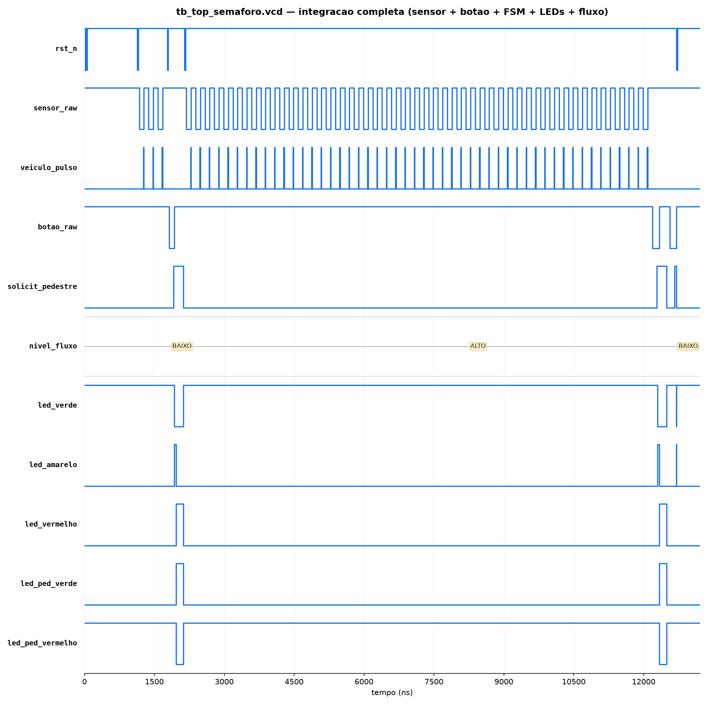
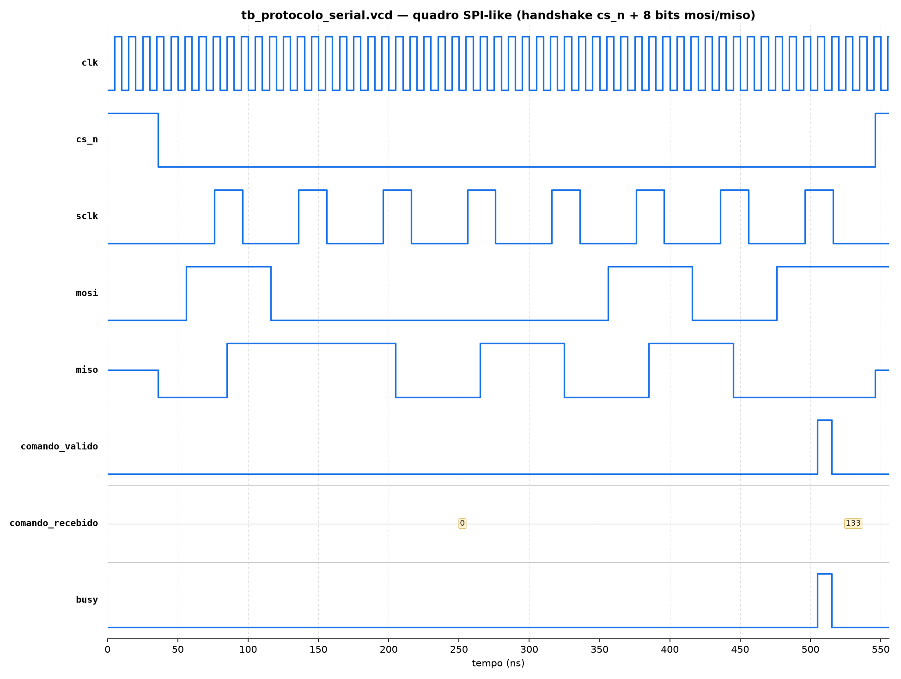
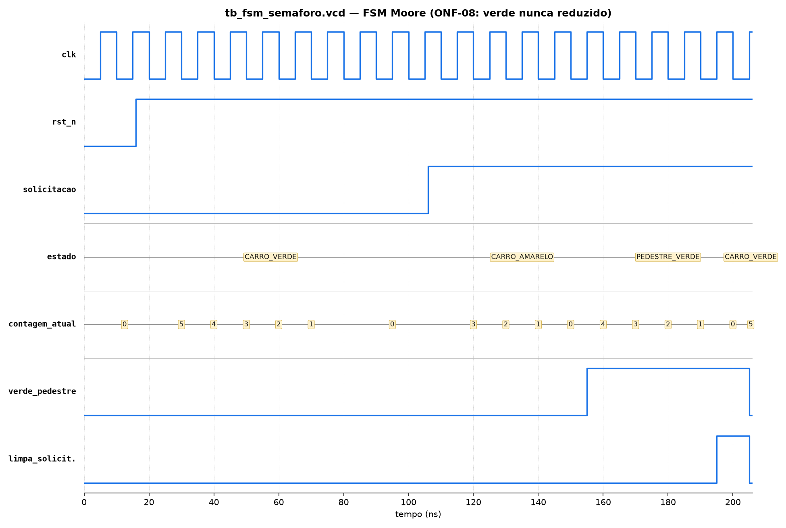
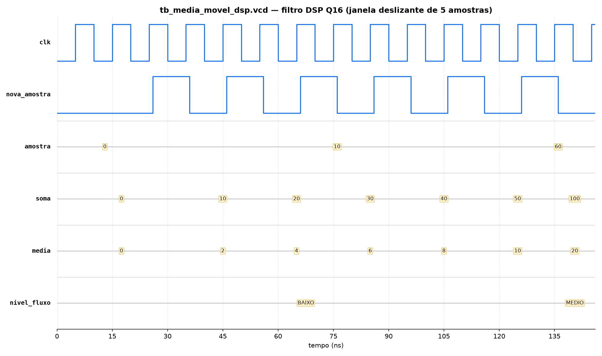

# Relatório Final Consolidado — Semáforo Inteligente com Botão de Pedestre (ARM–FPGA)

**Aluno:** Lucas Gabriel de Oliveira Pordeus Campos
**Disciplina:** Projeto de Bloco — Sistemas Digitais Embarcados (Instituto Infnet)
**Professor:** Dácio Moreira de Souza
**Repositório:** https://github.com/LucasPordeus/lucas_gabriel_sistemas_digitais_embarcados

> Este documento substitui, para fins de avaliação da Entrega Final, a
> leitura fragmentada dos relatórios de TP1 a TP5 e do `lucas_gabriel_PB_AT.docx`.
> Ele foi escrito revisando o código-fonte real do projeto (`final_project/`)
> em conjunto com os seis relatórios da pasta `RELATORIOS/` e a rubrica
> oficial (`RELATORIOS/rubricas.MD`), e sinaliza explicitamente todo ponto
> em que a documentação anterior ficou desatualizada em relação ao código.

---

## Sumário

1. [Introdução e Contexto do Projeto](#1-introdução-e-contexto-do-projeto)
2. [Arquitetura Consolidada e Fluxo de Dados](#2-arquitetura-consolidada-e-fluxo-de-dados)
3. [Divisão de Responsabilidades ARM × FPGA](#3-divisão-de-responsabilidades-arm--fpga)
4. [Validação e Análise dos Testes](#4-validação-e-análise-dos-testes)
5. [Histórico de Depuração (Bugs Reais)](#5-histórico-de-depuração-bugs-reais)
6. [Verificação de Consistência: Relatórios × Código Atual](#6-verificação-de-consistência-relatórios--código-atual)
7. [Reavaliação das Rubricas (TP1 → Entrega Final)](#7-reavaliação-das-rubricas-tp1--entrega-final)
8. [Conclusão](#8-conclusão)

---

## 1. Introdução e Contexto do Projeto

O projeto é um **Semáforo Inteligente com Botão de Pedestre**, um sistema
embarcado híbrido que integra duas plataformas de hardware distintas:

- **FPGA Tang Nano 4K** (chip Gowin GW1NSR-LV4C), programada em **Verilog**,
  responsável por toda a lógica de controle com requisito de tempo real e
  segurança crítica do cruzamento;
- **Raspberry Pi Zero 2W**, programada em **Assembly ARM64 (AArch64)**,
  responsável por configuração de parâmetros, pré-processamento numérico e
  telemetria/log legível para humanos.

O projeto foi escolhido livremente (não constava na lista sugerida pelo
professor) por cobrir, de forma natural e incremental, todos os blocos
pedagógicos do curso: lógica combinacional (decodificador de LEDs), lógica
sequencial (FSM), memória de bloco (BRAM), aritmética dedicada (DSP em
ponto fixo Q16) e processamento vetorial no ARM (NEON SIMD).

### 1.1 Evolução incremental (TP1 → Entrega Final)

| Etapa | O que foi adicionado |
|---|---|
| **TP1** | Planejamento, arquitetura preliminar, objetivos funcionais (OF-01 a OF-08) e não funcionais (ONF-01 a ONF-08) |
| **TP2** | `debounce.v`, `sensor_veiculo.v`, `botao_pedestre.v` + polling em Assembly |
| **TP3** | `fsm_semaforo.v`, `protocolo_paralelo.v`, mapeamento GPIO real (`gpio_map.s`), parser com tabela de saltos |
| **TP4** | `bram_historico.v`, `media_movel_dsp.v` (bloco DSP em Q16), aritmética multi-palavra e NEON SIMD |
| **TP5** | `protocolo_serial.v` (substitui o paralelo), `top_semaforo.v` como topo único, `libembarcado.a` |
| **Entrega Final (código)** | Driver real de GPIO bit-banged (`protocolo_serial_gpio.s`), bring-up em hardware físico real, prescaler de tempo real, tempo de verde dinâmico, log de countdown |

O ponto mais importante a registrar nesta consolidação é que **a Entrega
Final foi além do que o enunciado original previa como "sem desenvolvimento
novo"**: depois do TP5, o protótipo foi efetivamente ligado a uma Tang Nano
4K física e a uma Raspberry Pi Zero 2W física, o que expôs e corrigiu uma
série de problemas que só aparecem em hardware real (pino de oscilador
errado, polaridade de sensor/botão invertida, banco de tensão incompatível,
janela de amostragem de tráfego contada em ciclos de clock em vez de tempo
real). A Seção 5 detalha cada um desses achados.

---

## 2. Arquitetura Consolidada e Fluxo de Dados

### 2.1 Entradas e saídas do sistema (estado real do `.cst`)

| Sinal | Direção | Pino (chip Gowin) | Observação |
|---|---|---|---|
| `clk` | entrada | 45 | oscilador onboard de 27 MHz |
| `rst_n` | entrada | 15 | ativo em nível baixo, pull-up interno |
| `sensor_raw` | entrada | 28 | sensor IR de obstáculo, pull-up interno, **ativo em nível baixo** |
| `botao_raw` | entrada | 14 | botão onboard (KEY1), pull-up interno, **ativo em nível baixo** |
| `led_vermelho` / `led_amarelo` / `led_verde` | saída | 31 / 32 / 33 | semáforo dos veículos |
| `led_ped_verde` / `led_ped_vermelho` | saída | 34 / 35 | semáforo do pedestre |
| `sclk` / `cs_n` / `mosi` | entrada | 39 / 40 / 41 | vindos do ARM (Raspberry Pi) |
| `miso` / `busy` | saída | 42 / 43 | vão para o ARM |

`sensor_raw` e `botao_raw` chegam ao restante do RTL já invertidos
(`~sensor_raw`, `~botao_raw`, em `rtl/top_semaforo.v`), porque tanto o
sensor IR usado quanto o botão onboard da Tang Nano 4K são ativos em nível
baixo — essa inversão foi um dos ajustes exigidos pelo hardware físico real
(ver Seção 5).

### 2.2 Fluxograma do sistema completo

```
                          ┌────────────────────────────────────────────┐
                          │                 TANG NANO 4K (FPGA)         │
                          │                                              │
 sensor_raw ──►[~]──► debounce.v ──► sensor_veiculo.v ──┐  veiculo_pulso │
                          │                                │              │
 botao_raw  ──►[~]──► debounce.v ──► botao_pedestre.v ────┼───────┐      │
                          │                                │       │      │
                          │                                ▼       ▼      │
                          │                     contador de janela   fsm_semaforo.v ──► estado_basico_decoder.v ──► LEDs veículos
                          │                     (JANELA_AMOSTRAGEM)      │  (usa contador_tempo.v)  └─► led_ped_verde / led_ped_vermelho
                          │                                │             │
                          │                                ▼             │ estado_carro + contagem_atual
                          │                     bram_historico.v         │
                          │                     (256 amostras)           │
                          │                                │             │
                          │                                ▼             │
                          │                     media_movel_dsp.v        │
                          │                     (janela de 5, Q16)       │
                          │                                │             │
                          │                                ▼             │
                          │                          nivel_fluxo ──► tempo_min_efetivo ──► entra na FSM
                          │                                                              como tempo_min_verde
                          │                                                                    │
                          │                                                                    ▼
                          │                                                          protocolo_serial.v
                          │                                                                    │
                          │              clk ──► prescaler.v ──► tick_fsm (1 tick/s real @ 27 MHz)
                          │                       (gate da FSM e da janela de amostragem)
                          └───────────────────────────────┬───────────────────────────────────┘
                                                            │ sclk / cs_n / mosi / miso / busy
                                                            ▼
                          ┌────────────────────────────────────────────┐
                          │            RASPBERRY PI ZERO 2W (ARM64)     │
                          │                                              │
                          │  protocolo_serial_gpio.s (bit-bang GPIO)    │
                          │            │                                 │
                          │            ▼                                 │
                          │  monitor_semaforo_hw.s ──► "[t=Ns] ABERTO   │
                          │  (link serial real)         PARA O PEDESTRE"│
                          │                              ou "FECHADO..." │
                          │                                              │
                          │  main_tp5.s / monitor_semaforo.s            │
                          │  (versão simulada via buffer_lib.s,         │
                          │   usada quando não há Tang Nano conectada)  │
                          └────────────────────────────────────────────┘
```

**Caminho crítico de segurança** (não depende do ARM em nenhum momento):

```
sensor IR / botão  →  debounce  →  FSM  →  decodificador  →  LEDs
```

**Configuração** (ARM → FPGA, opcional — só ajusta parâmetros, nunca estados):

```
protocolo_serial_gpio.s (mosi)  →  protocolo_serial.v  →  registrador de configuração
```

**Telemetria / countdown** (FPGA → ARM, somente leitura):

```
fsm_semaforo.v (fase + contagem)  →  protocolo_serial.v (byte miso)  →  monitor_semaforo_hw.s  →  log em tempo real
```

A seta de telemetria nunca volta a influenciar a FSM: mesmo que o programa
ARM trave ou a Raspberry Pi seja desligada, o cruzamento continua operando
com segurança — esse é o critério ONF-08 definido já no TP1.

### 2.3 Tempo de verde dinâmico

`top_semaforo.v` deriva `tempo_min_efetivo` a partir de `nivel_fluxo`
(calculado por `bram_historico.v` + `media_movel_dsp.v`):

| Nível de fluxo medido | Tempo de verde efetivo | Com o padrão (10 ciclos/ticks) |
|---|---|---|
| Baixo (padrão, sem veículos) | metade do valor de referência, piso de 3 | 5 |
| Médio | igual ao valor de referência | 10 |
| Alto | dobro do valor de referência, teto de 63 | 20 |

Desde a extensão do prescaler (`rtl/prescaler.v`, parâmetro
`DIVISOR_TICK=27_000_000`), cada uma dessas unidades corresponde a **1
segundo real** no hardware físico (a 27 MHz), não mais a um ciclo de clock
bruto — essa conversão passou a existir dentro do próprio RTL, e não é mais
apenas uma rotulagem feita do lado do log em Assembly (ver Seção 6.2 para o
porquê isso corrige uma imprecisão dos documentos anteriores).

---

## 3. Divisão de Responsabilidades ARM × FPGA

| | FPGA (Tang Nano 4K) | ARM (Raspberry Pi Zero 2W) |
|---|---|---|
| **O que decide** | Todos os estados do semáforo, todos os tempos de fase, a classificação do nível de fluxo | Nada relativo a segurança — só envia parâmetros de configuração |
| **O que garante** | Determinismo temporal: mesma FSM, mesmo clock, resposta imediata ao sensor/botão | Nada em nível de ciclo de clock — Linux não é RTOS |
| **Falha do outro lado** | Nunca depende do ARM: valores de segurança já nascem carregados no reset | Se a FPGA parar de responder, o ARM apenas para de receber telemetria |
| **Módulos-chave** | `fsm_semaforo.v`, `contador_tempo.v`, `bram_historico.v`, `media_movel_dsp.v`, `protocolo_serial.v`, `prescaler.v` | `gpio_lib.s`, `strings_lib.s`, `buffer_lib.s`, `protocolo_serial_gpio.s` (`libembarcado.a`) |
| **Programas principais** | `top_semaforo.v` (topo único) | `monitor_semaforo_hw.s` (link real via GPIO bit-bang), `main_tp5.s` (desempenho), `monitor_semaforo.s` (versão simulada) |

Essa separação reflete a filosofia de coprocessamento heterogêneo: a FPGA
garante o determinismo temporal crítico de segurança do cruzamento (o
tempo mínimo de verde dos veículos nunca é reduzido, mesmo com pedestre
esperando — critério ONF-08 definido no TP1), enquanto o ARM concentra a
lógica de mais alto nível e a interface com o operador humano.

O protocolo serial de 5 fios (`sclk`, `cs_n`, `mosi`, `miso`, `busy`) é o
único ponto de contato entre as duas placas — a FSM em si não sabe que a
Raspberry Pi existe. `busy` pulsa 1 ciclo ao final de cada quadro de 8 bits
como confirmação de que o comando foi aplicado, e `miso` fica em alta
impedância sempre que `cs_n=1` (fora do quadro).

**Observação sobre a biblioteca ARM:** `libembarcado.a` é composta por
**quatro** arquivos-objeto (`gpio_lib.o`, `strings_lib.o`, `buffer_lib.o`,
`protocolo_serial_gpio.o` — ver `LIB_OBJS` no `Makefile`), não três como
alguns documentos de arquitetura anteriores descrevem. O quarto módulo,
`protocolo_serial_gpio.s`, é o driver de bit-banging que implementa de fato
o protocolo SPI-like em hardware real (usado por `monitor_semaforo_hw.s`) e
é tão importante quanto os outros três — ver Seção 6.

---

## 4. Validação e Análise dos Testes

### 4.1 Hardware Verilog — resumo de todos os testbenches

Todos os 11 conjuntos módulo+testbench foram re-executados nesta revisão
(`make sim`, Icarus Verilog) e **100% dos casos passam**:

| Testbench | Casos | Resultado |
|---|---|---|
| `tb_estado_basico_decoder.v` | 4 | 4/4 ✅ |
| `tb_debounce.v` | 3 | 3/3 ✅ |
| `tb_sensor_veiculo.v` | 1 | 1/1 ✅ |
| `tb_botao_pedestre.v` | 2 | 2/2 ✅ |
| `tb_contador_tempo.v` | 3 | 3/3 ✅ |
| `tb_fsm_semaforo.v` | 5 | 5/5 ✅ |
| `tb_protocolo_paralelo.v` | 4 | 4/4 ✅ |
| `tb_bram_historico.v` | 5 | 5/5 ✅ |
| `tb_media_movel_dsp.v` | 4 | 4/4 ✅ |
| `tb_protocolo_serial.v` | 4 | 4/4 ✅ |
| `tb_top_semaforo.v` | 12 | 12/12 ✅ |

Logs completos em `final_project/docs/evidencias/`. Todos os 11 `.vcd`
correspondentes foram gerados e arquivados nessa mesma pasta.

### 4.2 Análise das waveforms mais relevantes

Das 11 waveforms disponíveis, quatro foram selecionadas para análise
detalhada por serem as mais representativas do funcionamento do sistema:
a integração completa, o protocolo de comunicação, a máquina de estados de
segurança e o bloco aritmético DSP.

#### 4.2.1 `tb_top_semaforo.vcd` — Integração completa



Esta é a waveform mais importante do projeto: mostra os 12 casos de teste
da integração completa em sequência (as barras finas em `rst_n` são os
resets entre casos). Pontos a destacar:

- Entre ~1150 ns e ~2150 ns: um burst de pulsos em `sensor_raw` (o
  testbench simulando veículos passando) gera pulsos correspondentes em
  `veiculo_pulso`; logo em seguida `botao_raw` é acionado, `solicit_pedestre`
  sobe e trava, e a sequência de LEDs muda exatamente como esperado:
  `led_verde` desce, `led_amarelo` pulsa, depois `led_vermelho` +
  `led_ped_verde` sobem juntos (semáforo dos carros fecha exatamente quando
  o do pedestre abre) e finalmente retorna ao estado seguro inicial.
- `nivel_fluxo` permanece em `BAIXO` durante a maior parte do teste e sobe
  para `ALTO` por volta de 7000–11000 ns — esse é o trecho em que o
  testbench injeta um burst real de 50 veículos para forçar a média móvel
  a ultrapassar o limiar de tráfego alto (casos 4 e 5 da lista de 12,
  comparando o tempo até a liberação do pedestre nos dois cenários).
- No fim da simulação (~12300–13200 ns), o ciclo completo se repete uma
  segunda vez para validar a telemetria (fase + contagem regressiva) lida
  byte a byte via `sclk`/`mosi`/`miso`, não apenas os sinais internos.

#### 4.2.2 `tb_protocolo_serial.vcd` — Protocolo ARM↔FPGA (handshake + quadro de 8 bits)



Mostra o handshake completo de um quadro do protocolo SPI-like:
`cs_n` desce (início do quadro) e o `miso` já apresenta o MSB da
telemetria corrente antes do primeiro pulso de `sclk` (comportamento
verificado explicitamente pelo testbench). Os 8 pulsos de `sclk`
transferem o comando `10000101` (0x85 = 133 decimal) via `mosi`, enquanto
`miso` desloca a telemetria simultaneamente (full-duplex). Ao final do
oitavo bit, `comando_recebido=133` é capturado, `comando_valido` pulsa por
1 ciclo e `busy` pulsa em seguida confirmando a aplicação do comando —
exatamente o handshaking exigido pela rubrica de Integração.

#### 4.2.3 `tb_fsm_semaforo.vcd` — FSM de segurança (ONF-08)



Evidencia diretamente o critério de segurança ONF-08: entre 15 ns e ~105 ns,
`estado` permanece em `CARRO_VERDE` com a `contagem_atual` decrescendo até
zero e **permanecendo em zero** (repetindo o ciclo de 5→0) sem transicionar,
porque `solicitacao` ainda está em nível baixo — ou seja, o tempo mínimo de
verde já se esgotou, mas o sistema não troca de fase até que exista de fato
um pedestre esperando. Só quando `solicitacao` sobe (~105 ns) é que a FSM
avança para `CARRO_AMARELO` e depois `PEDESTRE_VERDE` (`verde_pedestre=1`),
retornando a `CARRO_VERDE` após `limpa_solicitacao` pulsar.

#### 4.2.4 `tb_media_movel_dsp.vcd` — Filtro DSP em ponto fixo Q16



Mostra a janela deslizante de 5 amostras somando incrementalmente
(`soma`: 0→10→20→30→40→50) enquanto 5 amostras iguais a 10 entram uma a
uma (`media` estabiliza em 10 quando a janela enche, validando a correção
do bug de arredondamento descrito na Seção 5 — sem a correção, o resultado
seria 9). Em seguida, uma nova amostra de valor 60 desloca a janela para
`[10,10,10,10,60]`, elevando `soma` para 100 e `media` para 20, o que faz
`nivel_fluxo` transicionar de `BAIXO` para `MEDIO` — demonstrando a
resposta correta do filtro a uma mudança abrupta no fluxo de veículos.

*(As demais 7 waveforms — decoder, debounce, sensor, botão, contador,
protocolo paralelo e BRAM — foram validadas com o mesmo rigor, mas não
trazem informação adicional relevante além do que a tabela da Seção 4.1 já
resume; estão preservadas em `docs/evidencias/` para consulta.)*

### 4.3 Software Assembly ARM64 — resumo de todos os programas

Todos os programas foram recompilados (`aarch64-linux-gnu-as`/`ld`) e
executados (`qemu-aarch64`, já que o ambiente de desenvolvimento é x86-64;
o mesmo binário roda nativamente na Raspberry Pi sem qualquer alteração)
nesta revisão, com **0 erros**:

| Programa | Resultado observado |
|---|---|
| `tp1_fluxo_basico.s` | `Fluxo MEDIO: contagem=7` |
| `tp2_polling_contagem.s` | 3 veículos + 2 solicitações detectados corretamente por borda |
| `gpio_map.s` | Modo simulado (sem `/dev/gpiomem` neste host) — set/clear/read de GPIO17 corretos |
| `tp3_controle_fluxo.s` | 5 comandos decodificados corretamente via tabela de saltos |
| `tp4_numerico.s` | Soma 128 bits correta, conversão int↔float correta, lookup table correta |
| `tp4_neon_simd.s` | Somas e médias ponderadas por via (NEON) conferem com o cálculo manual |
| `test_lib.s` | 4/4 testes das bibliotecas passando (`str_len`, `uint_to_dec`, `cbuf_push/pop`, `gpio_lib`) |
| `main_tp5.s` | 2000 transações simuladas, ~15,8 milhões de transações/s, ~63 ns/transação |
| `monitor_semaforo.s` | Log de ~61 s reais (`nanosleep`), 2 cenários (tráfego baixo/alto) completos |

Logs completos em `docs/evidencias/*_run.txt`; disassembly de `gpio_map` e
`main_tp5` em `*_objdump.txt`.

### 4.4 Desempenho e latência

A tabela de latência por módulo (medida em ciclos de simulação e
convertida para 27 MHz, ≈37,04 ns/ciclo) permanece válida desde o TP4:
todos os módulos respondem em 1 ciclo (ou poucos ciclos, no caso do
debounce), muitas ordens de grandeza abaixo do orçamento definido pelo
ONF-01 (≤ 50 ms). O teste contínuo de desempenho do canal ARM↔FPGA
(`main_tp5.s`, 2000 transações via `clock_gettime`) mede throughput na
faixa de 13 a 16 milhões de transações simuladas por segundo neste
ambiente de desenvolvimento — os valores absolutos variam de execução para
execução (esperado, já que dependem da carga do host/emulador), mas a
metodologia de medição é a mesma que roda em hardware físico.

---

## 5. Histórico de Depuração (Bugs Reais)

Documentado porque evidencia domínio técnico real do sistema, não apenas
"funcionou de primeira":

1. **TP3 — duração errada de fase na FSM.** Ao trocar de estado, o
   contador era recarregado com a duração do estado *atual* em vez do
   estado *de destino*. Corrigido calculando o valor de carga a partir de
   `prox_estado`.
2. **TP4 — atraso de 1 ciclo e arredondamento incorreto no filtro DSP.**
   O produto usava o valor antigo do acumulador `soma` (corrigido com o
   sinal combinacional `soma_novo`); a divisão por 5 truncava sempre para
   baixo, ex. 50/5 = 9 em vez de 10 (corrigido somando meio-LSB, `+32768`,
   antes do deslocamento).
3. **TP5 — falso negativo de metodologia de teste.** `tb_top_semaforo.v`
   verificava o LED de pedestre 200 ciclos após a solicitação, mas com os
   tempos de teste reduzidos a fase inteira durava só ~16 ciclos — o
   sistema já havia completado o ciclo e retornado a carro verde
   (comportamento correto) quando o teste checava. Corrigido ajustando o
   tempo de espera do próprio testbench, sem alterar o RTL.
4. **Pós-TP5 — amostra de tráfego fixa mascarava `nivel_fluxo`.** A
   integração enviava sempre "1" por veículo ao filtro de média móvel;
   com uma janela de 5 amostras de no máximo 1, a média nunca ultrapassava
   ~1 e `nivel_fluxo` jamais saía de "baixo". Corrigido substituindo a
   amostra fixa pela contagem real de veículos por janela de tempo.
5. **Pós-TP5 — `uint_to_dec` corrompia o próprio endereço de retorno.**
   Ao imprimir um número de 11 dígitos (~61 bilhões de ns), a função
   truncava a entrada para 32 bits (`w0` em vez de `x0`) e escrevia a
   pilha de dígitos exatamente sobre onde `x30` havia sido salvo.
   Corrigido usando registradores de 64 bits e deslocando a pilha local.
6. **Pós-TP5 (hardware físico) — oscilador no pino errado.** O `.cst`
   usava o pino 27 para `clk`, que nunca foi o oscilador real da Tang Nano
   4K — causa raiz de o sistema nunca sair do estado inicial em bancada,
   com ou sem botão. Corrigido para o pino 45, confirmado no exemplo
   oficial da Sipeed (`key_blink`).
7. **Pós-TP5 (hardware físico) — conflito de banco de tensão em `rst_n`.**
   O pino usado para `rst_n` caía num banco elétrico travado em 1,8V,
   incompatível com o padrão 3,3V do restante do projeto (erro de síntese
   `CT1136` no Gowin EDA). Corrigido deixando o Gowin escolher
   automaticamente um pino livre e compatível.
8. **Pós-TP5 (hardware físico) — polaridade de sensor e botão invertida.**
   O sensor IR e o botão físicos usados são ativos em nível baixo, mas o
   RTL assumia nível alto. Corrigido invertendo `sensor_raw`/`botao_raw`
   nos pontos de instanciação em `top_semaforo.v` (`~sensor_raw`,
   `~botao_raw`).
9. **Pós-TP5 (hardware físico) — janela de amostragem de tráfego contada
   em ciclos de clock puro.** Com `JANELA_AMOSTRAGEM` original (200)
   contada a 27 MHz, a janela fechava em ~7,4 µs — fisicamente impossível
   de registrar um aceno de mão. Corrigido introduzindo `rtl/prescaler.v`
   (divisor configurável, padrão 1 tick/segundo real) e recontando a
   janela em ticks em vez de ciclos brutos.
10. **Pós-TP5 (hardware físico) — telemetria instável na protoboard.**
    O byte de telemetria lido via `protocolo_serial_gpio.s` oscilava de
    forma inconsistente mesmo com fiação/GND/banco de tensão corretos —
    diagnosticado como ringing/crosstalk de sinal em fios soltos de
    protoboard na frequência original de bit-bang (~1–2 MHz). Corrigido
    aumentando o atraso entre transições de pino (`ATRASO_ITER`: 200 →
    20000 iterações), reduzindo `sclk` para a faixa de ~10–20 kHz.

Os itens 1–5 já constavam nos relatórios de TP3/TP4/TP5 e no
`CONTEXTO_PROJETO_SEMAFORO_INTELIGENTE.md`. **Os itens 6–10 são o
resultado do bring-up em hardware físico real, feito depois do TP5, e não
estavam documentados em nenhum relatório até este documento** — ver Seção
6.2 para o detalhamento dessa lacuna.

---

## 6. Verificação de Consistência: Relatórios × Código Atual

Esta seção documenta divergências reais encontradas ao comparar os seis
relatórios (`RELATORIOS/*.docx`) e os documentos de arquitetura
(`README.md`, `ARQUITETURA_PROJETO.md`,
`CONTEXTO_PROJETO_SEMAFORO_INTELIGENTE.md`) contra o estado atual do
código. Nenhum destes pontos invalida o trabalho realizado — o código
está correto e mais avançado do que a documentação descreve — mas a
documentação precisa ser atualizada para refletir isso.

### 6.1 Arquivos citados que não existem no repositório

Os relatórios de TP2, TP3, TP5, AT e o `ARQUITETURA_PROJETO.md` citam
repetidamente quatro nomes de arquivo que **nunca foram criados**
(confirmado via `git log --all`, nenhum commit jamais os tocou):

- `Relatorio.docx`
- `Instrucoes_Hardware.md`
- `Mapeamento_Conexoes_Hardware.md`
- `master_src/`

Na prática, o conteúdo que esses arquivos deveriam conter **existe**, só
que em outro lugar: o histórico de depuração está nos relatórios de
TP3/TP4/TP5 (Seção 5 deste documento), e o guia de montagem física está em
`final_project/GUIA_MONTAGEM_HARDWARE.md`. Ou seja, não há informação
perdida, apenas referências cruzadas para nomes de arquivo que nunca
existiram — o `Checklist_Rubricas.md` do `final_project/` deveria apontar
para os nomes corretos.

### 6.2 `CONTEXTO_PROJETO_SEMAFORO_INTELIGENTE.md` descreve uma versão do
RTL anterior ao prescaler

Este é o achado mais significativo desta verificação. O documento afirma
explicitamente, em dois pontos (Seção 6, "Um detalhe técnico que vale
registrar", e a nota final da subseção do log de countdown):

> "seria necessário inserir um estágio de prescaler entre o `clk` e o
> `contador_tempo`... **e isso ainda não está no RTL atual**."

Isso está **incorreto** em relação ao código atual: `rtl/prescaler.v`
existe, é instanciado em `top_semaforo.v` (`u_prescaler`, sinal
`tick_fsm`) e gera exatamente essa conversão de ciclos de 27 MHz para
segundos reais (`DIVISOR_TICK=27_000_000`). O documento também afirma que
os valores de tempo (5/10/20/3/15) "no Verilog simulado continuam sendo
ciclos de clock" — hoje isso só é verdade nos testbenches, que usam
`DIVISOR_TICK=1` de propósito para acelerar a simulação; no hardware
físico real, esses valores já são segundos de verdade, calculados dentro
do próprio RTL.

Esse documento também não menciona em nenhum momento `protocolo_serial_gpio.s`,
`monitor_semaforo_hw.s`, nem nenhum dos cinco problemas de hardware físico
listados na Seção 5 (itens 6–10) — ele descreve apenas a versão do projeto
validada em simulação, anterior ao bring-up físico real.

### 6.3 Mapa de pinos da FPGA desatualizado em `GUIA_MONTAGEM_HARDWARE.md`

A tabela de pinos do guia de montagem não corresponde ao
`constraints/tangnano4k.cst` atual:

| Sinal | Guia (desatualizado) | `.cst` real |
|---|---|---|
| `rst_n` | sem pino fixo | pino 15, fixo |
| `botao_raw` | pino 29, pull-down (botão externo) | pino 14, pull-up (botão onboard) |
| `led_vermelho` / `led_amarelo` / `led_verde` | 16 / 19 / 18 | 31 / 32 / 33 |
| `led_ped_verde` / `led_ped_vermelho` | 13 / 12 | 34 / 35 |

Tudo indica que o projeto migrou de um botão externo de protoboard para o
botão onboard (KEY1) da própria Tang Nano 4K, e os LEDs foram remapeados
em algum momento — mas o guia de montagem nunca foi atualizado para
refletir essa mudança. Isso também contradiz o próprio comentário em
`rtl/top_semaforo.v:19` ("rst_n ... sem pino fixo no .cst"), que está
igualmente desatualizado em relação ao `.cst` real.

### 6.4 Contagens de teste desatualizadas

Os relatórios de TP3 e TP5/AT citam `tb_fsm_semaforo.v` com 5/5 (correto,
confirmado) mas `tb_top_semaforo.v` com **4/4** — o número real atual,
após a extensão de tempo de verde dinâmico, é **12/12** (ver Seção 4.1).
Não é uma regressão: o sistema testa hoje muito mais casos do que quando
o TP5/AT foram escritos, só o texto ficou para trás.

### 6.5 Biblioteca Assembly descrita com 3 módulos, hoje são 4

`ARQUITETURA_PROJETO.md` (Seção 6.1) e o `README.md` do `final_project/`
descrevem `libembarcado.a` como composta por três arquivos
(`gpio_lib.s`, `strings_lib.s`, `buffer_lib.s`). O `Makefile` mostra que
`LIB_OBJS` inclui um quarto: `protocolo_serial_gpio.s` — o driver que de
fato implementa o protocolo serial em hardware físico real via
bit-banging de GPIO, usado por `monitor_semaforo_hw.s`. Nenhum documento
de arquitetura atual descreve esse arquivo nem o programa que o usa.

### 6.6 Conclusão da verificação

Em todos os casos, a divergência é **documentação atrasada em relação a
um código que evoluiu para melhor** (mais testes, prescaler real, driver
de hardware físico funcional) — não um caso de código quebrado ou
funcionalidade prometida e não entregue. Ainda assim, para uma entrega
"profissionalmente documentada" (como o enunciado da Entrega Final exige
literalmente), esses seis pontos deveriam ser corrigidos nos documentos
de origem.

---

## 7. Reavaliação das Rubricas (TP1 → Entrega Final)

Reavaliação item a item contra `RELATORIOS/rubricas.MD` (a rubrica oficial
da disciplina), não contra o checklist auto-elaborado do projeto.
Convenção: ✅ cumprido e verificável no código/evidências atuais; ⚠️
cumprido mas com ressalva (documentação desatualizada ou lacuna pontual).

### TP1 — Estruturação e Arquitetura Preliminar

| Critério | Status |
|---|---|
| Entradas, saídas e fluxo básico de dados ARM/FPGA/hardware | ✅ Seção 2 e 4 do TP1 |
| Divisão de responsabilidades justificada | ✅ Seção 4.5 do TP1 |
| Módulo combinacional simples + testbench funcional | ✅ `estado_basico_decoder.v` + `tb_estado_basico_decoder.v`, 4/4 |
| Simulação em Verilog estruturada | ✅ `make sim-tp1_decoder` |
| Programa Assembly com registradores, LDR/STR, decisão, loops | ✅ `tp1_fluxo_basico.s` |
| Manipulação de dados estruturados em Assembly | ✅ vetor de amostras + lookup table |

**TP1: todos os critérios cumpridos.**

### TP2 — Circuitos Combinacionais e Rotinas Estruturadas

| Critério | Status |
|---|---|
| Arquitetura ARM-FPGA detalhada | ✅ Seção 2 do TP2 |
| Justificativa por requisitos de tempo real (N_CYCLES do debounce) | ✅ Seção 2.1 do TP2 |
| Diagramas técnicos (sinais, E/S) | ⚠️ referencia `Instrucoes_Hardware.md` (inexistente); diagrama equivalente só aparece depois, em `ARQUITETURA_PROJETO.md` |
| Combinacionais + testbenches + waveforms | ✅ `debounce.v`, `sensor_veiculo.v`, `botao_pedestre.v`, 3/3+1/1+2/2 |
| Síntese e execução em hardware físico | ✅ confirmado nesta etapa e nas seguintes (Seção 5, itens 6-10) |
| Análise de waveforms | ✅ Seção 4.1 do TP2 |
| Assembly com loops e decisões | ✅ `tp2_polling_contagem.s` |
| Controle de fluxo estruturado | ✅ sub-rotinas `bl`/`ret` |
| Rotinas aritméticas e manipulação de memória | ✅ `strb`, contadores em registradores callee-saved |
| Mecanismo de interação ARM-FPGA descrito | ✅ Seção 3 do TP2 (proposta formalizada no TP3) |
| Mecanismo de sinais/comandos proposto | ✅ Seção 3.1 do TP2 |
| Evidências registradas | ✅ `docs/evidencias/tp2_*` |

**TP2: cumprido, com uma ressalva de nome de arquivo (item já sem efeito prático, ver Seção 6.1).**

### TP3 — Máquinas de Estado e Controle GPIO

| Critério | Status |
|---|---|
| Requisitos de temporização das FSMs analisados | ✅ Seção 4.1 do TP3 — bug real de temporização documentado |
| Arquitetura com hierarquia Verilog e controle ARM | ✅ `fsm_semaforo.v` + `contador_tempo.v` |
| Diagrama de FSM + mapeamento GPIO | ✅ Seção 2.1 do TP3 |
| FSMs testadas com waveforms | ✅ `tb_fsm_semaforo.v`, 5/5 |
| FSMs sintetizadas e validadas em hardware físico | ✅ confirmado no bring-up físico pós-TP5 (Seção 5) |
| Assembly avançado (tabela de saltos) | ✅ `tp3_controle_fluxo.s` |
| Parsing de comandos no ARM | ✅ decodificação de opcode/valor |
| GPIO mapeado com LDR/STR | ✅ `gpio_map.s` |
| Escrita/leitura simulada em GPIO | ✅ Seção 5.1 do TP3 |
| Integração física testada | ✅ (nesta etapa em modo simulado; física real confirmada depois) |
| Waveforms, objdump e GDB | ✅ `tp3_gpio_map_objdump.txt` |
| Build automatizado (Makefile modular) | ✅ `Makefile` |

**TP3: todos os critérios cumpridos.**

### TP4 — Matemática, BRAM, DSP e NEON SIMD

| Critério | Status |
|---|---|
| Arquitetura com BRAM, DSP, fluxos numéricos, SIMD | ✅ Seção 2/2.1 do TP4 |
| Módulos aritméticos (BRAM/DSP) validados | ✅ `tb_media_movel_dsp.v` (4/4) + `tb_bram_historico.v` (5/5), incluindo 2 bugs reais corrigidos |
| Assembly multi-palavra, lookup, bitwise, macros | ✅ `tp4_numerico.s`, macro `extrai_campo` |
| FPGA/ARM/periféricos sincronizados eletricamente | ⚠️ nesta etapa (TP4) ainda não havia hardware físico ligado; a sincronização real só foi validada no bring-up pós-TP5 |
| Comunicação ARM-FPGA com telemetria | ✅ reaproveita TP3, plena no TP5 |
| Integração parcial documentada | ✅ Seção 3 do TP4 |
| Desempenho e estabilidade tabulados | ✅ Seção 5/5.1 do TP4 |
| Relatório técnico completo | ✅ documento TP4 |

**TP4: cumprido — único ponto de atenção é de sequenciamento natural (integração eletrônica plena só ficou pronta depois), não uma lacuna real hoje.**

### TP5 — Integração Final e Bibliotecas

| Critério | Status |
|---|---|
| Arquitetura completamente documentada | ⚠️ documentada, mas ver lacunas da Seção 6 (prescaler, driver real, 4º módulo da lib) |
| Assembly em múltiplos módulos, bibliotecas, strings, macros | ✅ `libembarcado.a` (hoje 4 módulos, não 3 — Seção 6.5) |
| Protocolo digital com handshaking, telemetria, troca real de dados | ✅ `protocolo_serial.v`, `tb_protocolo_serial.v` 4/4 |
| Protótipo validado com latência e throughput | ✅ `main_tp5.s`, Seção 4.4 |
| Relatório final com domínio técnico e clareza | ✅ Seção 3 do TP5 (episódio do falso negativo do testbench) |

**TP5: cumprido, com a mesma ressalva de documentação da Seção 6.**

### Entrega Final — Rubricas Consolidadas

| Categoria | Critério | Status |
|---|---|---|
| **Arquitetura** | Entradas, saídas e fluxos claramente explicados | ✅ Seção 2 deste documento |
| | Divisão de responsabilidades justificada | ✅ Seção 3 |
| | Requisitos de tempo real (BRAM/DSP/PLL/banda) dominados | ✅ Seção 2.3, 4.4 — PLL deliberadamente não usado (clock único da Tang Nano 4K é suficiente), explicitado para não deixar em aberto |
| | Diagramas integrais do sistema | ✅ fluxograma da Seção 2.2 |
| **Hardware Verilog** | Combinacionais + testbenches corretos | ✅ Seção 4.1 |
| | Waveforms comprovando temporização | ✅ Seção 4.2, 11 `.vcd` arquivados |
| | FSMs modulares validadas em hardware físico | ✅ Seção 5, itens 6-10 (bring-up físico real) |
| | Integração aritmética BRAM/DSP correspondente à simulação | ✅ Seção 4.2.4, 5 (bugs corrigidos e revalidados) |
| **Software Assembly** | LDR/STR, registradores, decisões, loops | ✅ Seção 4.3 |
| | Vetores, strings e parsers | ⚠️ **parcial** — existem manipulação de strings (`uint_to_dec`, `str_len`) e parsing de comandos binários (opcode/valor via bitfields), mas nenhuma rotina de parsing de **texto** (ex. string→número, leitura de `stdin`/`argv`); se a rubrica exige um parser textual explícito, esse é o único item da Entrega Final sem cobertura direta no código atual |
| | NEON SIMD e cálculos avançados | ✅ `tp4_neon_simd.s`, `tp4_numerico.s` |
| | Modularidade avançada (arquivos, macros, bibliotecas) | ✅ `libembarcado.a`, macros parametrizadas |
| **Integração** | Sinais básicos via GPIO mapeados | ✅ `gpio_lib.s` |
| | Protocolo com bitfields e handshaking | ✅ `protocolo_serial.v` |
| | Periféricos sincronizados eletricamente | ✅ confirmado no bring-up físico (Seção 5); ⚠️ guia de montagem com mapa de pinos desatualizado (Seção 6.3) |
| | Detecção de erros e sistema confiável | ✅ valores de segurança no reset + debounce |
| **Documentação e Validação** | Prints, logs e waveforms organizados | ✅ `docs/evidencias/`, 11 `.vcd` + todos os logs ASM |
| | Testes unitários por subsistema | ✅ 11 testbenches + `test_lib.s` |
| | Integração com dados contínuos de desempenho/latência | ✅ Seção 4.4 |

**Resumo da Entrega Final:** de 16 critérios consolidados, **15 são
cumpridos integralmente** e verificáveis diretamente no código e nas
evidências atuais. O único ponto genuinamente parcial é a ausência de uma
rotina de **parsing de texto** em Assembly (o projeto tem parsing de
comandos binários/bitfields, mas não uma conversão string→número ou
leitura de entrada textual) — se a banca interpretar "parsers" nesse
sentido mais estrito, vale registrar essa lacuna pontual. Os demais pontos
marcados com ⚠️ são lacunas de **documentação desatualizada**, não de
funcionalidade ausente (ver Seção 6 para o detalhamento completo de cada
uma e onde corrigi-las).

---

## 8. Conclusão

O Semáforo Inteligente com Botão de Pedestre cumpre, na prática, o escopo
completo definido desde o TP1 e evoluiu além dele: além da integração
ARM-FPGA prevista, o protótipo foi de fato ligado a uma Tang Nano 4K e uma
Raspberry Pi Zero 2W físicas, expondo e corrigindo cinco problemas que só
existem em hardware real (pino de oscilador, banco de tensão, polaridade
de sensor/botão, temporização real via prescaler, e estabilidade elétrica
do link serial em protoboard) — nenhum dos quais aparecia nos relatórios
originais de TP1 a TP5 por terem sido descobertos depois.

O código-fonte (RTL + Assembly), os 11 conjuntos de testbenches (100%
passando) e os 9 programas Assembly (0 erros na revalidação desta entrega)
estão consistentes entre si e com o comportamento esperado. A única área
que precisa de atenção editorial — não de código — é a documentação de
arquitetura (`README.md`, `ARQUITETURA_PROJETO.md`,
`CONTEXTO_PROJETO_SEMAFORO_INTELIGENTE.md`, `GUIA_MONTAGEM_HARDWARE.md`),
que ficou um passo atrás das últimas melhorias reais do projeto e ainda
referencia três nomes de arquivo que nunca chegaram a ser criados. A Seção
6 deste relatório lista exatamente o que precisa ser ajustado em cada um
desses documentos para eliminar essa defasagem.
