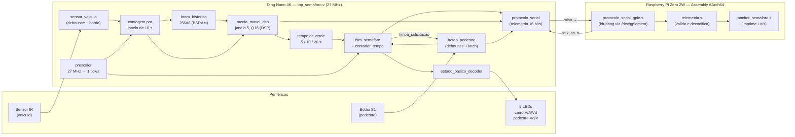
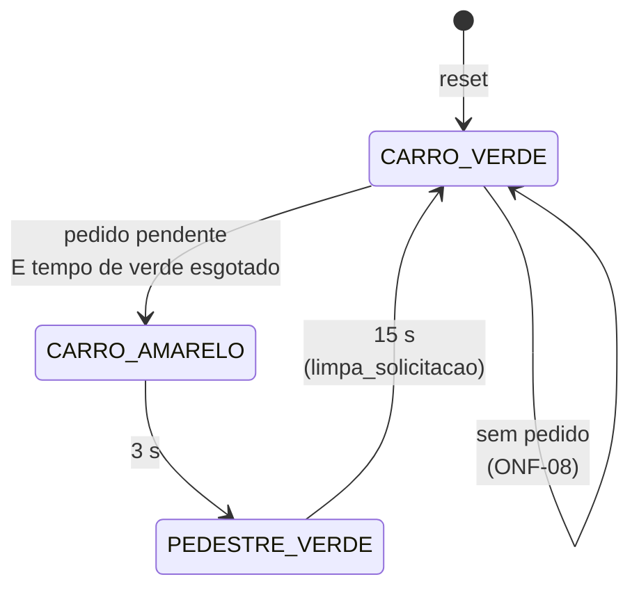

# Semáforo Inteligente com Botão de Pedestre — Sistema Híbrido ARM + FPGA

> Material de apoio para apresentação. Visão geral do projeto, arquitetura,
> módulos de hardware (Verilog) e software (Assembly ARM64), protocolo de
> comunicação, validação e resultados.

---

## 1. O problema e a ideia em uma frase

Um cruzamento com travessia de pedestres **sob demanda**: os carros ficam
no verde até alguém apertar o botão; o tempo de verde **se adapta sozinho
ao volume de trânsito** medido por um sensor de veículos.

**A FPGA decide e age (tempo real, segurança); a Raspberry Pi só observa
(monitor somente leitura, não crítico).**


### Plataforma

| Papel | Placa | Destaques |
|---|---|---|
| Hardware determinístico | **Tang Nano 4K** (FPGA Gowin GW1NSR-LV4C) | clock 27 MHz onboard, BRAM e DSP nativos |
| Software de monitoramento | **Raspberry Pi Zero 2W** (ARM Cortex-A53, AArch64) | Assembly ARM64 puro, sem libc, syscalls Linux diretas |
| Periféricos | protoboard | sensor IR de obstáculo (veículo), 5 LEDs; botão de pedestre = S1 da própria Tang Nano |

---

## 2. Requisitos principais

- **Verde para os carros por padrão:** o semáforo só sai do verde dos carros se
  houver pedido de pedestre pendente.
- **Regra de segurança ONF-08:** o trânsito nunca é interrompido sem pedido;
  pedestre verde só com carro vermelho; estado inválido força vermelho; o
  funcionamento **nunca depende** do ARM.
- **Tempo de verde dinâmico:** fluxo baixo → pedestre atravessa mais rápido;
  fluxo alto → pedestre espera mais.
- **Comunicação FPGA→ARM:** protocolo serial síncrono **somente de telemetria**;
  a Raspberry Pi não configura nada.
- **Uso de recursos dedicados da FPGA:** BRAM (histórico) e DSP (filtro).

---

## 3. Arquitetura geral

### 3.1 Diagrama de blocos do sistema



### 3.2 Divisão de responsabilidades (e por quê)

| | FPGA (Tang Nano 4K) | ARM (Raspberry Pi) |
|---|---|---|
| **Faz** | Lê sensor e botão, filtra ruído, mede fluxo, decide fases, acende LEDs, envia telemetria | Lê a telemetria, valida o quadro e imprime o estado |
| **Natureza** | Determinística, ciclo a ciclo, lógica cabeada | Best-effort, sistema operacional Linux |
| **Crítico p/ segurança?** | **Sim** | **Não** |
| **Se falhar/desligar** | — | Semáforo continua idêntico |

**Justificativa:** um sistema operacional de uso geral (Linux) tem latência
não determinística (escalonador, interrupções, swap). A decisão "posso
fechar o verde agora?" precisa ser garantida a cada ciclo de clock — isso
é papel do hardware. O ARM fica com o que se beneficia de flexibilidade de
software: visualização e registro do estado.

**Analogia:** a FPGA é o semáforo de rua; a Raspberry Pi é uma câmera
apontada para ele — se a câmera desligar, o semáforo segue funcionando.

### 3.3 Fluxo de dados (do sensor ao LED)

1. **Sensor IR** gera nível baixo quando detecta obstáculo → invertido no topo
   → `debounce` (2 flip-flops de sincronização + 5 ms estáveis) → detecção de
   borda → **1 pulso por veículo**.
2. Pulsos são contados numa **janela de 10 s**; ao fechar a janela, a contagem
   vira uma amostra, gravada na **BRAM**.
3. **Média móvel** das últimas 5 amostras (~50 s de histórico; a amostra que
   sai é lida da BRAM) → `nivel_fluxo` **baixo (0–7) / médio (8–17) / alto (≥ 18)**
   carros nos últimos 50 s.
4. `nivel_fluxo` escolhe o **tempo de verde**: 5 / 10 / 20 s.
5. **Botão S1** → debounce (20 ms) → borda → **latch** de solicitação.
6. **FSM** sai do verde quando há pedido e o tempo de verde acabou; um pedido
   novo reinicia a espera para pelo menos o tempo de verde atual.
7. **Decoder** converte a cor em LEDs; a telemetria sai pelo `miso`.

---

## 4. Hardware — módulos Verilog (`rtl/`)

| Módulo | Tipo | Função |
|---|---|---|
| `top_semaforo.v` | Topo | Integra tudo; sincroniza o reset; contagem por janela; tempo de verde por fluxo; monta o quadro de telemetria |
| `debounce.v` | Sequencial | Sincronizador de 2 flip-flops + filtro de N ciclos estáveis |
| `sensor_veiculo.v` | Sequencial | Debounce + pulso de 1 ciclo por veículo |
| `botao_pedestre.v` | Sequencial | Debounce + latch de solicitação, limpo pela FSM |
| `prescaler.v` | Sequencial | Divide 27 MHz → 1 tick/s |
| `contador_tempo.v` | Sequencial | Temporizador decrescente (carrega / decrementa / `zerou`) |
| `fsm_semaforo.v` | FSM Moore | 3 estados de fase, usa `contador_tempo` |
| `estado_basico_decoder.v` | Combinacional | Cor 2 bits → 3 LEDs; código inválido acende vermelho |
| `bram_historico.v` | Memória | Histórico circular 256×8 de amostras de fluxo → **BSRAM** |
| `media_movel_dsp.v` | Aritmético | Média de 5 amostras com multiplicação Q16 → **DSP** |
| `protocolo_serial.v` | Interface | Escravo estilo SPI modo 0, só envia (16 bits por quadro) |

### 4.1 Do sensor à BRAM: cada etapa trata uma escala de tempo

O sensor não grava direto na BRAM: o sinal bruto muda a qualquer instante e
oscila várias vezes por carro, e a BRAM recebe **um número a cada 10 s**.
Cada etapa trata uma escala de tempo:

```
pino 39 ─► ~ (inverte) ─► sensor_veiculo ─► contador de janela ─► bram_historico ─► media_movel_dsp
           0 = carro       1 pulso/carro    carros em 10 s        1 gravação/10 s    tendência de ~50 s
                                                 ▲
                                      prescaler (1 tick/s)
```

| Escala | Problema | Quem resolve |
|---|---|---|
| nanossegundos | sinal assíncrono (metaestabilidade) | 2 flip-flops de sincronização |
| milissegundos | oscilação perto do limiar | debounce: 5 ms estáveis (135 000 ciclos) |
| centenas de ms | o carro fica na frente do sensor | detecção de borda → **1 pulso de 1 ciclo por carro** |
| segundos | taxa de fluxo | contador de janela de 10 s (satura em 255) |
| minutos | tendência do tráfego | BRAM + média das últimas 5 janelas |

Ao fechar a janela, o contador entrega dois sinais, atualizados na mesma
borda, que vão **direto** para a BRAM e para a média:

| Sinal | Ligado em | Significado |
|---|---|---|
| `nova_amostra` | `escreve` | pulso de 1 ciclo a cada 10 s |
| `amostra_fluxo` | `dado_escrita` | carros contados na janela |

Um carro que passe exatamente no ciclo de fechamento entra na amostra que
está sendo entregue (`contagem_com_pulso`), e não se perde.

### 4.2 Histórico em BRAM (`bram_historico.v`)

```verilog
(* ram_style = "block", syn_ramstyle = "block_ram" *)
reg [7:0] memoria [0:255];                       // 256 amostras de 8 bits

always @(posedge clk) begin                      // sem rst_n: vira BSRAM
    if (escreve) memoria[ponteiro_escrita] <= dado_escrita;
    dado_leitura <= memoria[endereco_leitura];    // leitura síncrona (1 ciclo)
end
```

- **Buffer circular:** o ponteiro de escrita tem 8 bits; depois de 255 volta
  a 0 sozinho, sobrescrevendo a amostra mais antiga.
- **Duas portas:** grava em `ptr` e lê em `ptr − 5`, que é a amostra que
  está saindo da média.
- **Leitura síncrona:** o dado sai 1 ciclo depois do endereço, como no bloco
  físico. O atraso não aparece porque o ponteiro fica parado 10 s entre
  gravações: a leitura já está pronta muito antes da próxima amostra.
- **Atributos:** `ram_style` (Yosys) e `syn_ramstyle` (Gowin EDA) pedem um
  bloco BRAM. Confirmado no place & route: **1/10 BSRAM** usada.

**Por que a memória não tem reset.** Uma BRAM grava um endereço por ciclo;
não existe fio que zere as 256 posições de uma vez. Com reset no código, a
síntese montaria a memória com **2048 flip-flops** (~60% dos flip-flops da
Tang Nano 4K) e a BRAM sumiria. Por isso só o ponteiro tem reset. O
conteúdo antigo continua lá depois de apertar S2, e quem impede que ele
entre na conta é a média móvel (seção 4.3).

| Momento | Memória |
|---|---|
| Ligar a placa | começa zerada (o bitstream inicializa a BSRAM) |
| Apertar S2 | ponteiro volta a 0; as amostras antigas **permanecem** |

### 4.3 Média móvel no DSP (`media_movel_dsp.v`)

**Por que média.** Uma janela isolada engana: um intervalo vazio entre dois
grupos de carros faria o fluxo pular de "alto" para "baixo". A média das
últimas 5 janelas (~50 s) mostra a tendência.

**Soma incremental com a BRAM.** O módulo guarda só a soma; as 5 amostras
ficam na BRAM. A cada janela, uma única leitura basta:

```verilog
assign valor_saindo = (amostras_validas == 5) ? amostra_saindo : 8'd0;
assign soma_nova    = soma - valor_saindo + amostra;
```

**Amostras válidas.** Nas 5 primeiras janelas depois do reset, a posição
`ptr − 5` ainda tem lixo de antes do reset, que nunca foi somado. Um contador
de 3 bits faz o filtro subtrair 0 até a janela encher. A partir da 6ª
amostra, `ptr − 5` já foi regravada e o valor lido é sempre novo. Ou seja, um
contador de 3 bits substitui os 2048 flip-flops que um reset na memória
exigiria.

**Divisão por 5 sem divisor.** Multiplica pelo recíproco em ponto fixo Q16
(`1/5 × 65536 ≈ 13107`), mapeado no bloco **MULT18X18**:

```verilog
assign produto       = soma_nova * 17'd13107;     // DSP
assign produto_arred = produto + 28'd32768;       // + 0,5 → arredonda
assign media_nova    = produto_arred[23:16];      // parte inteira
```

| Passo | `soma_nova = 13` |
|---|---|
| 13 × 13107 | 170 391 (= 2,59998 em Q16) |
| + 32 768 (0,5) | 203 159 (= 3,09998) |
| bits [23:16] | **3** = round(13 / 5 = 2,6) ✓ |

Pegar os bits [23:16] equivale a dividir por 65 536 sem nenhuma conta: é só
escolher fios. O erro da aproximação é no máximo ~0,004, pequeno demais para
mudar o arredondamento.

**Tudo em um ciclo.** Na borda em que `nova_amostra = 1`, a BRAM grava a
amostra nova e avança o ponteiro; na mesma borda, a média atualiza soma,
média e nível usando a amostra antiga, que já estava pronta na saída da BRAM.

**Exemplo com a BRAM** (ponteiro = 10, entra uma janela com 6 carros):

| Posição da BRAM | 5 | 6 | 7 | 8 | 9 | 10 |
|---|---|---|---|---|---|---|
| Carros | **4** (sai) | 6 | 0 | 5 | 5 | ← entra **6** |

`soma` = 20 → `soma_nova` = 20 − 4 + 6 = **22** → média = round(4,4) = **4**
→ fluxo **alto** → verde de **20 s**.

### 4.4 Quantos carros definem cada fluxo

A média é comparada com `LIMIAR_BAIXO = 1` e `LIMIAR_ALTO = 3` (carros por
janela de 10 s). Por causa do arredondamento, o que vale é o **total nos
últimos 50 s**:

| Fluxo | Média por janela | Total nos últimos 50 s | Tempo de verde |
|---|---|---|---|
| **Baixo** | 0 ou 1 | **0 a 7 carros** | 5 s |
| **Médio** | 2 ou 3 | **8 a 17 carros** | 10 s |
| **Alto** | 4 ou mais | **18 ou mais** | 20 s |

Os cortes ficam em 7/8 e 17/18: 7 ÷ 5 = 1,4 → 1; 8 ÷ 5 = 1,6 → 2;
17 ÷ 5 = 3,4 → 3; 18 ÷ 5 = 3,6 → 4.

| Carros por janela (antiga → nova) | Total | Fluxo |
|---|---|---|
| 1, 2, 1, 2, 1 | 7 | baixo |
| 0, 0, 0, 0, 8 | 8 | médio |
| 4, 4, 4, 3, 3 | 18 | alto |
| 0, 0, 0, 0, 18 | 18 | alto (uma janela cheia já basta) |

- O nível só muda quando uma janela fecha (a cada 10 s).
- Depois de um período de fluxo alto, voltar a baixo leva até 50 s sem carros.

### 4.5 Máquina de estados (`fsm_semaforo.v`)



| Estado | Código | Carros | Pedestre | Sai quando |
|---|---|---|---|---|
| `CARRO_VERDE` | `00` | verde | vermelho | há pedido **e** o tempo de verde acabou |
| `CARRO_AMARELO` | `01` | amarelo | vermelho | passaram 3 s |
| `PEDESTRE_VERDE` | `10` | vermelho | verde | passaram 15 s |

Para a FSM, todo o caminho sensor → BRAM → média se resume a um número:
`tempo_verde` (5, 10 ou 20).

**Três blocos:**

| Bloco | Tipo | Função |
|---|---|---|
| A — registrador de estado | sequencial | guarda `estado`; reset → `CARRO_VERDE` |
| B — próximo estado e saídas | combinacional | decide a troca e as cores (Moore: só dependem do estado) |
| C — carga do temporizador | combinacional | escolhe o que carregar no `contador_tempo` e quando |

**Como o tempo é medido.** Ao entrar numa fase, o `contador_tempo` recebe a
duração dela; a cada tick (1 s) desconta 1; em 0, `tempo_esgotado` libera a
troca. A carga usa `prox_estado` (a fase que vai começar): no ciclo da troca
amarelo → pedestre, carrega 15, e não 3. A flag `iniciou` força a primeira
carga logo após o reset, garantindo o verde mínimo desde que a placa liga.

**A regra do pedido novo (onde o fluxo afeta o pedestre).** Sem pedido, o
verde fica aceso por minutos e o contador fica parado em 0. Se o pedido só
fosse considerado ao entrar no verde, um aperto 3 minutos depois liberaria o
pedestre na hora, com qualquer fluxo. Por isso, quando um pedido **novo**
chega durante o verde, a espera é recarregada:

```verilog
assign pedido_novo = solicitacao_pedestre & ~solicitacao_ant;   // borda do pedido
carrega_cont = !iniciou || (prox_estado != estado)
            || (estado == CARRO_VERDE && pedido_novo && contagem_atual < tempo_verde);
```

A espera vale o **maior** entre o que ainda falta e o tempo de verde:

| Situação | Falta | `tempo_verde` | Espera do pedestre |
|---|---|---|---|
| Verde aceso há minutos, fluxo baixo | 0 | 5 | **5 s** |
| Verde aceso há minutos, fluxo alto | 0 | 20 | **20 s** |
| Pedido 1 s após o verde começar, fluxo baixo | 4 | 5 | 5 s (as esperas não somam) |
| Já faltava mais que o tempo de verde | 18 | 5 | 18 s (não recarrega) |

A condição de troca tem `!pedido_novo` para segurar a FSM por 1 ciclo: no
ciclo em que o pedido chega, o contador ainda pode estar em 0 e a recarga só
vale na borda seguinte.

**Segurança:**
- `pedestre_verde = 1` aparece só em `PEDESTRE_VERDE`, onde o carro é
  vermelho. Como as saídas são Moore, nenhuma combinação de entradas acende
  os dois verdes juntos.
- A única saída de `CARRO_VERDE` exige pedido: sem pedido, o trânsito não para.
- Valores padrão "tudo vermelho" no início do bloco B; o código inválido `11`
  passa 1 ciclo em vermelho e volta a `CARRO_VERDE`.
- No último ciclo da travessia, `limpa_solicitacao` apaga o pedido, então um
  aperto durante o amarelo ou a travessia é descartado.

**Exemplo (fluxo baixo):**

| Tempo | Evento | Estado | Contador | Carro / pedestre |
|---|---|---|---|---|
| 0 s | liga a placa (`iniciou` → carrega 5) | CARRO_VERDE | 5 | verde / vermelho |
| 5 s | contador zera, sem pedido | CARRO_VERDE | 0 | verde / vermelho |
| 120 s | aperta S1 → recarrega 5 | CARRO_VERDE | 5 | verde / vermelho |
| 125 s | zerou e há pedido → carrega 3 | CARRO_AMARELO | 3 | amarelo / vermelho |
| 128 s | zerou → carrega 15 | PEDESTRE_VERDE | 15 | vermelho / **verde** |
| 143 s | zerou → apaga o pedido, carrega 5 | CARRO_VERDE | 5 | verde / vermelho |

Com fluxo alto, a única diferença é em 120 s: o contador recebe **20** e o
amarelo começa em 140 s.

### 4.6 Clock, tempo real e por que não há PLL

- Clock único: oscilador onboard de **27 MHz** (pino 45).
- O `prescaler` gera **1 tick por segundo**; a FSM e o amostrador avançam
  só nos ticks → tempos em segundos reais, observáveis a olho nu.
- **PLL não é necessário:** nenhuma parte do projeto exige frequência maior
  ou diferente de 27 MHz. A lógica mais rápida (debounce, detecção de bordas
  do `sclk`) roda folgada a 27 MHz (frequência máxima no place & route: 198 MHz),
  e o protocolo serial opera na ordem de 10 kHz. Um PLL só adicionaria complexidade
  e consumo.

---

## 5. Comunicação FPGA → ARM

### 5.1 Protocolo serial (`protocolo_serial.v`)

Estilo **SPI modo 0** (CPOL=0, CPHA=0), **16 bits**, MSB primeiro, **só de
leitura**. O ARM é o mestre (gera o clock); a FPGA só responde.

| Sinal | Direção | Raspberry (BCM / pino) | Tang Nano 4K | Função |
|---|---|---|---|---|
| `sclk` | ARM → FPGA | GPIO11 / 23 | 40 | clock serial |
| `cs_n` | ARM → FPGA | GPIO6 / 31 | 42 | delimita o quadro (ativo em baixo) |
| `miso` | FPGA → ARM | GPIO20 / 38 | 33 | bits de telemetria |
| GND | — | 39 | GND | referência comum |

**Delimitação:** enquanto `cs_n = 1`, a FPGA copia o quadro atual a cada ciclo.
Quando `cs_n` desce, o quadro é congelado (todos os campos do mesmo instante) e
o bit 15 já aparece em `miso`; a cada subida de `sclk` vem o próximo bit.

`sclk` e `cs_n` passam por **2 flip-flops de sincronização** (vêm de outra placa).
Não existe `mosi`: nada vai do ARM para a FPGA.

### 5.2 Formato do quadro (FPGA → ARM)

| Bits | Campo | Valores |
|---|---|---|
| 15–12 | marcador | sempre `1010` |
| 11–10 | cor dos carros | `00` vermelho, `01` amarelo, `10` verde |
| 9 | cor do pedestre | `1` verde, `0` vermelho |
| 8 | pedido pendente | `1` sim |
| 7–6 | nível de fluxo | `00` baixo, `01` médio, `10` alto |
| 5–0 | segundos restantes da fase | 0–63 |

O ARM rejeita quadros com marcador errado, códigos `11` ou pedestre verde com
carro fora do vermelho — o que também detecta fio solto ou GND ausente.

### 5.3 Driver no ARM (`asm/lib/protocolo_serial_gpio.s`)

- Mapeia os registradores GPIO do BCM2710 via `mmap` de `/dev/gpiomem`; se não
  conseguir, o programa **para com erro** (não há modo simulado).
- **Bit-banging**: `GPFSELn` (direção), `GPSET0`/`GPCLR0` (escrita só da
  máscara do pino) e `GPLEV0` (leitura); lê `miso` **antes** de subir `sclk`.
- Atraso de dezenas de µs entre transições, robusto com fios de protoboard.

---

## 6. Software — Assembly AArch64 (`asm/`)

Tudo em Assembly ARM64 puro (GNU `as`/`ld`), **sem libc**: E/S, tempo e
memória via syscalls Linux diretas (`write`, `openat`, `mmap`, `close`,
`clock_gettime`, `nanosleep`, `exit`). Convenção de chamada **AAPCS64**.

| Arquivo | Funções |
|---|---|
| `lib/gpio_lib.s` | `gpio_map_init`, `gpio_configura_pino`, `gpio_escreve`, `gpio_le` |
| `lib/protocolo_serial_gpio.s` | `protocolo_serial_configura_pinos`, `protocolo_serial_le_quadro` |
| `lib/telemetria.s` | `telemetria_valida`, `telemetria_formata` (tabelas de texto indexadas pelos campos) |
| `lib/strings_lib.s` | `uint_to_dec`, `str_copia`, `escreve_fd` |
| `monitor_semaforo.s` | laço: lê quadro → decodifica → imprime `[t=Ns] ...` → dorme 1 s |

Exemplo de saída:

```
[t=12s] carros=VERDE pedestres=VERMELHO restante=4s fluxo=MEDIO pedido=SIM
```

Os programas dos TP1–TP5 (benchmarks, NEON, monitor simulado) não fazem parte
do sistema final e continuam nas pastas `../TP1` a `../TP5`.

---

## 7. Integração física

### 7.1 Pinagem da FPGA (fonte: `constraints/tangnano4k.cst`)

| Sinal | Pino | Banco | Configuração |
|---|---|---|---|
| `clk` | 45 | 1 (3,3 V) | oscilador 27 MHz |
| `rst_n` | 15 | 3 (1,8 V) | botão onboard S2, LVCMOS18 |
| `botao_raw` | 14 | 3 (1,8 V) | botão onboard S1, LVCMOS18 |
| `sensor_raw` | 39 | 1 (3,3 V) | pull-up; sensor IR ativo em baixo |
| `led_vermelho` / `led_amarelo` / `led_verde` | 41 / 43 / 44 | 1 (3,3 V) | LVCMOS33, 8 mA |
| `led_ped_verde` / `led_ped_vermelho` | 46 / 10 | 1 / 0 (3,3 V) | LVCMOS33, 8 mA |
| `sclk` / `cs_n` | 40 / 42 | 1 (3,3 V) | entradas (pull-down / pull-up) |
| `miso` | 33 | 2 (2,5 V) | saída LVCMOS25 |

Os pinos 28 e 31–35 da versão anterior estão no banco de 2,5 V (HDMI) e foram
abandonados: o sensor de 3,3 V ficava acima da tensão do banco e os LEDs com
brilho reduzido. Detalhes em `GUIA_MONTAGEM_HARDWARE.md`.

### 7.2 Ligação Raspberry Pi ↔ Tang Nano 4K

| Raspberry Pi (BCM / pino físico) | Tang Nano 4K | Sinal |
|---|---|---|
| GPIO11 / 23 | 40 | `sclk` |
| GPIO6 / 31 | 42 | `cs_n` |
| GPIO20 / 38 | 33 | `miso` |
| GND / 39 | GND | **referência comum obrigatória** |

Ligação direta, sem conversor de nível. Cada placa tem sua própria alimentação
USB; só sinais e GND são compartilhados. Cada LED usa resistor de 220 Ω.

---

## 8. Verificação e validação

### 8.1 Simulação (Icarus Verilog)

`make sim` roda 10 testbenches auto-verificáveis (`[OK]`/`[FALHA]`), sem
warnings; os `.vcd` ficam em `build/`.

| Testbench | O que verifica |
|---|---|
| `tb_debounce` | ignora repique, propaga níveis estáveis |
| `tb_sensor_veiculo` | 1 pulso por veículo, mesmo com repique |
| `tb_botao_pedestre` | latch, limpeza, toque curto ignorado |
| `tb_contador_tempo` | carga, decremento, parada em zero, prioridade |
| `tb_estado_basico_decoder` | 4 códigos de cor, inválido = vermelho |
| `tb_bram_historico` | ponteiro e leitura síncrona |
| `tb_media_movel_dsp` | BRAM + DSP contra modelo de referência; BRAM suja antes do reset |
| `tb_protocolo_serial` | quadro de 16 bits, congelamento durante a leitura |
| `tb_fsm_semaforo` | ciclo completo, espera após pedido, invariante de segurança |
| `tb_top_semaforo` | integração só pelos pinos: fluxo baixo ~5 s vs. alto ~20 s, telemetria, LEDs seguros |

### 8.2 Síntese e software (evidências em `docs/evidencias/`)

- **Síntese + place & route** (Yosys/nextpnr, `GW1NSR-LV4CQN48PC7/I6`): sem
  warnings, 198 MHz máximo, 1 BSRAM, 1 MULT18X18, bitstream gerado.
- **ARM:** montagem sem warnings; o decodificador foi conferido nos **65 536
  quadros possíveis** contra uma referência independente; o driver foi
  conferido contra um modelo do registrador de deslocamento da FPGA.

### 8.3 Bugs reais encontrados e corrigidos

| Bug | Causa | Correção |
|---|---|---|
| Média móvel nunca saía de "baixo" na integração | amostra enviada ao filtro era fixa em 1 por veículo | amostra passou a ser a **contagem de veículos por janela de tempo** |
| Média com atraso de 1 ciclo e arredondamento errado | média calculada sobre a soma antiga; truncamento puro | cálculo sobre `soma_nova` e soma de 0,5 LSB antes do shift |
| `uint_to_dec` corrompia o endereço de retorno | usava registradores de 32 bits e empilhava dígitos sobre o `x30` salvo | registradores de 64 bits e área de dígitos em `[sp+16]` |
| Semáforo não avançava na placa | `clk` mapeado no pino errado (27) | pino real do oscilador: **45** |
| Fases duravam ~370 ns (invisível) | FSM contava ciclos de clock puros | `prescaler` de 1 tick/s |
| BRAM não existia no hardware | gravava sempre `1` e ninguém lia → removida na síntese | passou a guardar as amostras lidas pela média |
| Fluxo não influía no caso comum | o tempo de verde só era aplicado ao entrar no verde | também vale a partir do aperto do botão |
| Debounce inútil para botão | 8 ciclos = 300 ns | 20 ms (botão) e 5 ms (sensor) |
| Sensor e LEDs no banco de 2,5 V | pinos 28 e 31–35 (HDMI) | movidos para os bancos de 3,3 V |

---

## 9. Evolução incremental (TP1 → Final)

| Etapa | Hardware (Verilog) | Software (ARM64) |
|---|---|---|
| TP1 | decoder combinacional | fundamentos: laço, `LDR/STR`, decisão |
| TP2 | debounce, sensor, botão | polling de status com bitfields |
| TP3 | contador, FSM, protocolo paralelo | jump table, GPIO via `mmap` |
| TP4 | BRAM + média móvel em DSP | 128 bits, ponto flutuante, **NEON** |
| TP5 | protocolo serial + topo integrado | biblioteca estática, benchmark |
| Final | foco no hardware real: pinagem por banco, debounce em ms, BRAM real, telemetria só de leitura | monitor real (sem simulação), decodificador validado |

---

## 10. Como executar

```bash
# Simulação e síntese (no PC)
make sim                 # todos os testbenches
make sim-top_semaforo    # só o teste de integração
make synth               # Yosys + nextpnr + Apicula -> build/top_semaforo.fs

# FPGA pelo Gowin EDA: GW1NSR-LV4CQN48PC7/I6, rtl/*.v + constraints/*, topo top_semaforo

# Raspberry Pi (64 bits)
make asm
make run                 # sudo ./build/monitor_semaforo
```

---

## 11. Mensagens-chave para fechar a apresentação

1. **Segurança por arquitetura:** a decisão crítica vive no hardware; o link
   com o ARM é só de saída, então o software não tem como mexer no semáforo.
2. **Adaptação ao trânsito real:** sensor → janela → BRAM → média móvel →
   nível de fluxo → tempo de verde, tudo em hardware.
3. **Recursos dedicados bem usados:** BRAM para histórico, DSP com aritmética
   em ponto fixo para evitar divisão — confirmados no place & route.
4. **Protocolo próprio com quadro validado** (marcador + coerência), com driver
   bit-bang em Assembly puro do outro lado.
5. **Validação:** 10 testbenches, síntese sem warnings e decodificador
   conferido em todos os 65 536 quadros possíveis.


## 12. Glossário de conceitos

### 12.1 Plataformas e fluxo de projeto em FPGA

| Conceito | O que é | Onde aparece no projeto |
|---|---|---|
| **FPGA** | *Field-Programmable Gate Array*: chip com milhares de blocos lógicos que podem ser interligados para formar um circuito digital sob medida. Não executa um programa; vira o próprio circuito, e todos os blocos operam em paralelo a cada ciclo de clock. | Tang Nano 4K, onde roda toda a lógica do semáforo |
| **ARM / AArch64** | Arquitetura de processador; AArch64 é o modo de 64 bits (ARMv8). Executa instruções em sequência, sob um sistema operacional. | Raspberry Pi Zero 2W (Cortex-A53) |
| **Verilog / RTL** | Linguagem de descrição de hardware. RTL (*Register Transfer Level*) descreve o circuito como registradores e a lógica entre eles. | pasta `rtl/` |
| **Síntese** | Ferramenta que converte o Verilog em portas lógicas, flip-flops e blocos da FPGA. | Gowin EDA → *Synthesize* |
| **Place & Route** | Etapa que decide onde cada bloco fica fisicamente no chip e como os fios são roteados. | Gowin EDA → *Place & Route* |
| **Bitstream** | Arquivo final gravado na FPGA que a configura com o circuito projetado. | `build/top_semaforo.fs` ou Gowin EDA |
| **Constraints (`.cst`)** | Arquivo que associa cada sinal do Verilog a um pino físico do chip e define padrão elétrico, pull e corrente. | `constraints/tangnano4k.cst` |
| **LUT / Flip-flop** | Recursos básicos da FPGA. A LUT (*Look-Up Table*) implementa qualquer função lógica pequena; o flip-flop guarda 1 bit entre ciclos de clock. | usados por quase todos os módulos |

### 12.2 Recursos dedicados da FPGA

| Conceito | O que é | Onde aparece no projeto |
|---|---|---|
| **BRAM** | *Block RAM*: blocos de memória já prontos dentro da FPGA. Guardar muitos dados neles economiza LUTs e flip-flops. A ferramenta reconhece ("infere") uma BRAM quando a memória é síncrona, com portas de leitura e escrita. | `bram_historico.v` (256 × 8 bits, 1 BSRAM) |
| **DSP** | Bloco dedicado de multiplicação e acumulação (*Digital Signal Processing*). Faz multiplicações muito mais rápido e com menos recursos do que montá-las em LUTs. | `media_movel_dsp.v` (multiplicação Q16) |
| **PLL** | *Phase-Locked Loop*: circuito que gera novos clocks (mais rápidos, mais lentos ou defasados) a partir de um clock de referência. | **não usado**: 27 MHz atende todo o projeto |
| **Clock** | Sinal periódico que sincroniza todos os flip-flops; cada borda de subida é um passo do circuito. | oscilador de 27 MHz (pino 45) |
| **Prescaler** | Divisor de frequência: conta N ciclos de clock e gera um pulso (*tick*). Resolve o problema de "tempo lento" sem precisar de um PLL. | `prescaler.v` (27 MHz → 1 tick/s) |

### 12.3 Lógica digital

| Conceito | O que é | Onde aparece no projeto |
|---|---|---|
| **Lógica combinacional** | A saída depende só das entradas naquele instante; não tem memória nem clock. | `estado_basico_decoder.v` |
| **Lógica sequencial** | A saída depende das entradas **e** do estado guardado; atualiza na borda do clock. | contadores, FSM, filtros |
| **FSM (máquina de estados)** | Circuito que fica sempre em um entre vários estados possíveis e muda de estado conforme condições. Na **Moore**, as saídas dependem só do estado atual, o que evita glitches. | `fsm_semaforo.v` |
| **Reset assíncrono ativo em baixo (`rst_n`)** | Sinal que leva o circuito ao estado inicial assim que vai para 0, sem esperar o clock. O `_n` indica que é ativo em nível baixo. | todos os módulos |
| **Debounce** | Filtro contra o "repique" mecânico de botões e o ruído de sensores: só aceita um novo nível depois de N ciclos estáveis. | `debounce.v` (20 ms botão, 5 ms sensor) |
| **Metaestabilidade / sincronizador** | Quando um sinal externo muda perto da borda do clock, o flip-flop pode ficar num valor indefinido por um instante. Passar o sinal por 2 flip-flops antes de usá-lo reduz esse risco. | `debounce.v`, `protocolo_serial.v`, reset em `top_semaforo.v` |
| **Detecção de borda** | Compara o valor atual com o do ciclo anterior para gerar um pulso de 1 ciclo no momento da transição. | `sensor_veiculo.v`, `botao_pedestre.v`, `protocolo_serial.v` |
| **Latch de solicitação** | Registrador que "lembra" um evento (botão apertado) até ser limpo explicitamente. | `botao_pedestre.v` |
| **Ponto fixo (Q16)** | Representa frações com inteiros: o valor é guardado multiplicado por 2¹⁶. Dá para dividir por 5 multiplicando por 13107 e deslocando 16 bits, sem usar divisor. | `media_movel_dsp.v` |
| **Média móvel** | Média das últimas N amostras, que "desliza" a cada amostra nova; suaviza variações bruscas. | janela de 5 amostras |
| **Buffer circular** | Vetor em que o índice volta ao início ao chegar ao fim; mantém sempre os dados mais recentes, sem mover nada na memória. | `bram_historico.v` |

### 12.4 Comunicação e elétrica

| Conceito | O que é | Onde aparece no projeto |
|---|---|---|
| **Protocolo serial síncrono** | Transmite bits um a um por um fio, acompanhados de um clock compartilhado que diz quando ler cada bit. | `protocolo_serial.v` |
| **SPI (SCLK, MOSI, MISO, CS)** | Padrão serial com mestre e escravo. SCLK = clock; MOSI = dados do mestre para o escravo; MISO = dados do escravo para o mestre; CS = seleciona o escravo. **Modo 0** (CPOL=0, CPHA=0): clock em repouso baixo e dado amostrado na borda de subida. | ARM (mestre) ↔ FPGA (escrava) |
| **Handshake** | Combinação entre as partes que marca início e fim de uma transferência, para nenhum lado se perder. | `cs_n` desce no início e sobe no fim do quadro |
| **Telemetria** | Envio periódico de medições e do estado interno de um sistema para monitoramento remoto. | quadro de 16 bits: cores, pedido, fluxo, tempo restante |
| **Pull-up / Pull-down** | Resistor (interno ou externo) que mantém um pino em 1 (pull-up) ou 0 (pull-down) quando nada o comanda, evitando entrada "flutuando". | botão, sensor e pinos do protocolo |
| **Ativo em baixo** | O sinal indica "evento" quando está em 0. | sensor IR, botão onboard, `cs_n`, `rst_n` |
| **LVCMOS33 / 25 / 18** | Padrões elétricos de 3,3 / 2,5 / 1,8 V. Cada banco de I/O da FPGA tem uma tensão fixa, e todo pino do banco segue essa tensão. | `.cst` |
| **GPIO** | *General Purpose Input/Output*: pinos digitais configuráveis por software como entrada ou saída. | pinos BCM 6, 11 e 20 da Raspberry Pi |
| **Bit-banging** | Implementar um protocolo por software, ligando e desligando os GPIOs "na mão", sem um periférico de hardware dedicado. | `protocolo_serial_gpio.s` |

### 12.5 Software ARM

| Conceito | O que é | Onde aparece no projeto |
|---|---|---|
| **Assembly** | Linguagem de mais baixo nível legível por humanos: cada linha corresponde a uma instrução da CPU. | pasta `asm/` |
| **Registradores** | Pequenas memórias dentro da CPU (`x0`–`x30` no AArch64) onde as operações acontecem. | todos os programas |
| **Syscall** | Chamada direta ao kernel do Linux (instrução `svc #0`) para fazer E/S, mapear memória, medir tempo etc. | `write`, `openat`, `mmap`, `clock_gettime`, `nanosleep` |
| **`mmap` + `/dev/gpiomem`** | Mapeia os registradores físicos de GPIO no espaço de memória do programa, que passa a controlar os pinos com simples `LDR`/`STR`. | `gpio_lib.s` |
| **Registradores GPIO (GPFSEL, GPSET, GPCLR, GPLEV)** | Registradores do chip BCM2710: GPFSEL define entrada/saída; GPSET coloca o pino em 1; GPCLR coloca em 0; GPLEV lê o nível atual. | `gpio_lib.s`, `protocolo_serial_gpio.s` |
| **AAPCS64** | Convenção de chamada do ARM64: parâmetros em `x0`–`x7`, retorno em `x0`, e `x19`–`x28` preservados por quem é chamado. | todas as funções da biblioteca |
| **Biblioteca estática (`.a`)** | Arquivo com funções já montadas que o *linker* copia para dentro de cada programa que as usa. | `libembarcado.a` |
| **Macro** | Trecho de código parametrizado que o montador expande onde for usado. | `acrescenta`, `acrescenta_tabela`, `segundos_monotonicos` |
| **Tabela indexada** | Vetor de endereços indexado por um valor, em vez de vários `if`. | `telemetria.s` (texto de cada cor/fluxo) |

### 12.6 Tempo real e desempenho

| Conceito | O que é | Onde aparece no projeto |
|---|---|---|
| **Tempo real / determinismo** | Garantia de que uma resposta ocorre **sempre** dentro de um prazo conhecido, não apenas "rápido na média". | FPGA decide a fase a cada ciclo de 37 ns |
| **`CLOCK_MONOTONIC`** | Relógio do Linux que nunca volta para trás (não é afetado por ajustes de hora); ideal para medir intervalos. | `clock_gettime` no monitor (`[t=Ns]`) |

### 12.7 Verificação

| Conceito | O que é | Onde aparece no projeto |
|---|---|---|
| **Testbench** | Código Verilog que gera estímulos para um módulo e confere automaticamente as saídas esperadas. | pasta `tb/` (10 testbenches) |
| **Simulação (Icarus Verilog)** | Executa o Verilog no PC, sem hardware, para validar o comportamento antes de gravar na FPGA. | `make sim` |
| **Waveform / VCD** | Registro, ao longo do tempo, de todos os sinais da simulação, visualizado como formas de onda. | `.vcd` em `build/`, abertos no GTKWave |
| **ONF-08** | Requisito de segurança do projeto: nunca interromper o trânsito sem pedido, e nunca depender do ARM para funcionar. | FSM e arquitetura geral |

---
